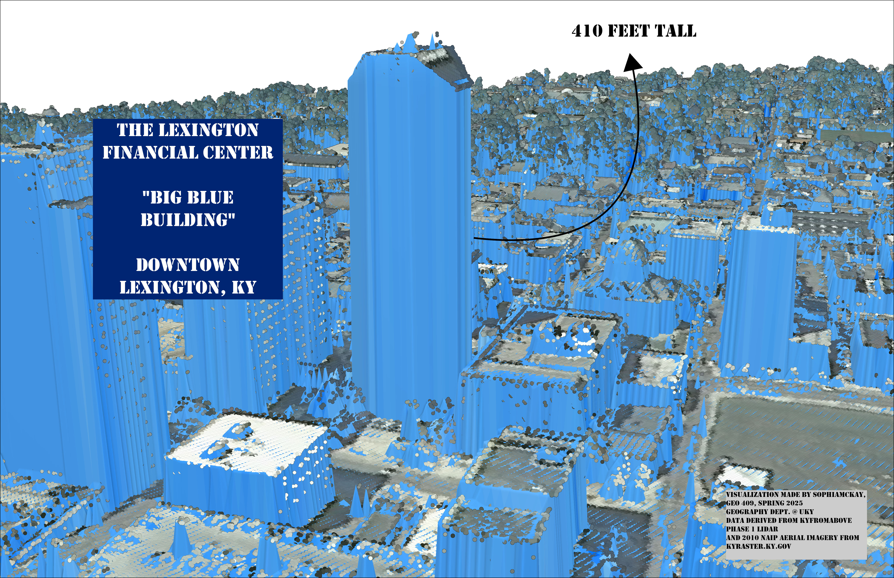
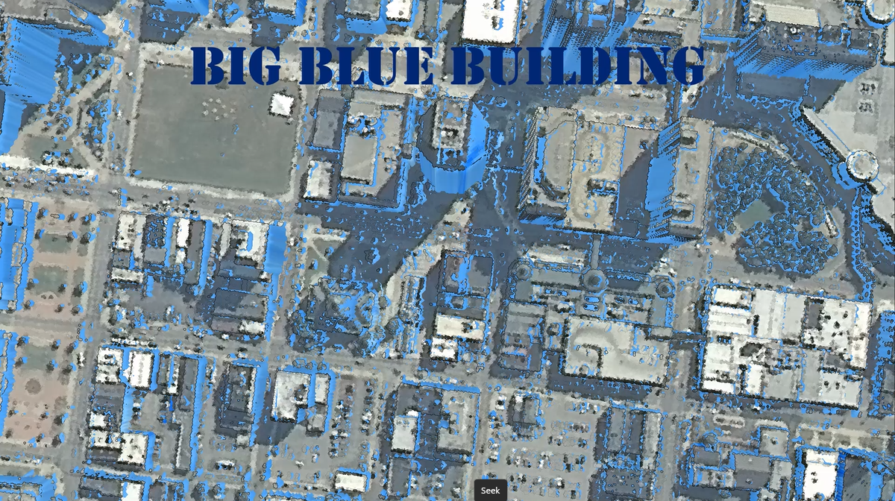

# The Big Blue Building

The "Big Blue Building," officially The Lexington Financial Center, is the tallest building in Lexington. Locals fondly dub it as the "Tallest Building in the World," as it is a beacon for downtown Lexington from several miles outside of the city.

  
_Big Blue Building Layout_

  
_[Big Blue Building Aerial Imagery](https://youtu.be/--CnVOzhgpI)
